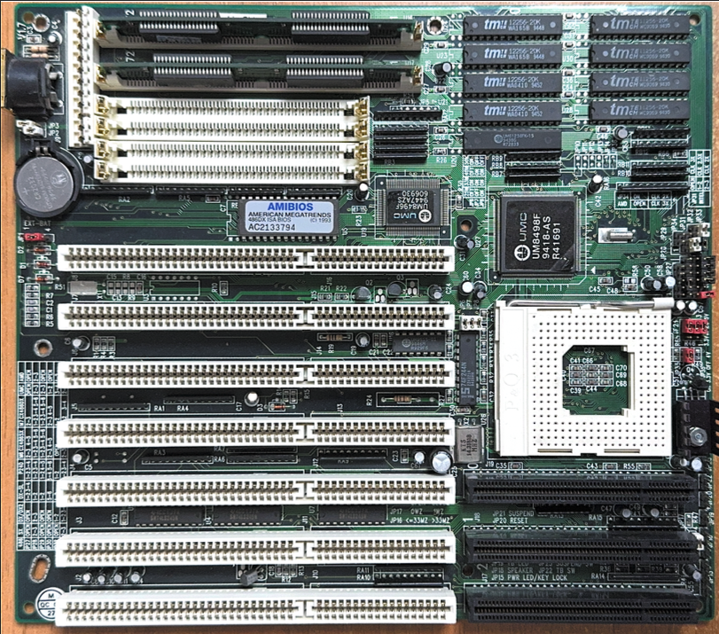
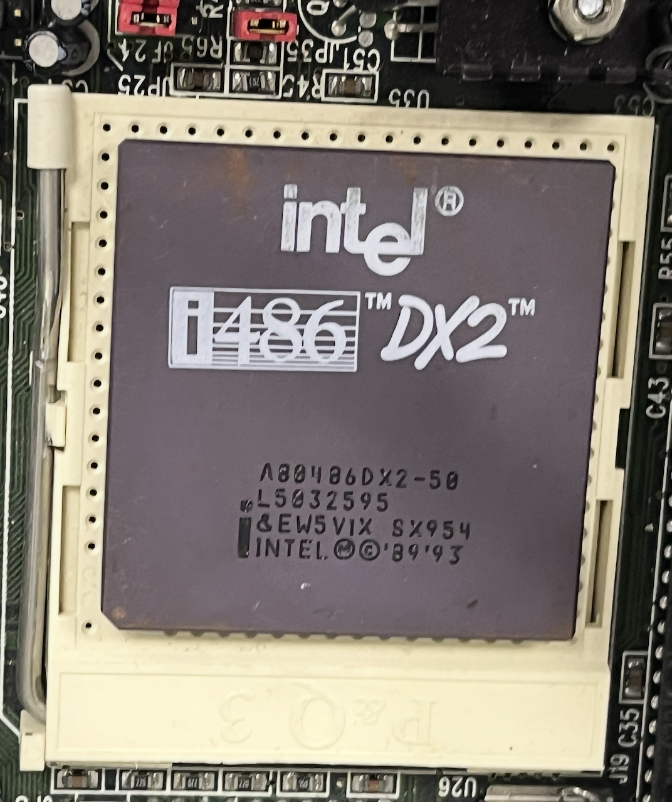
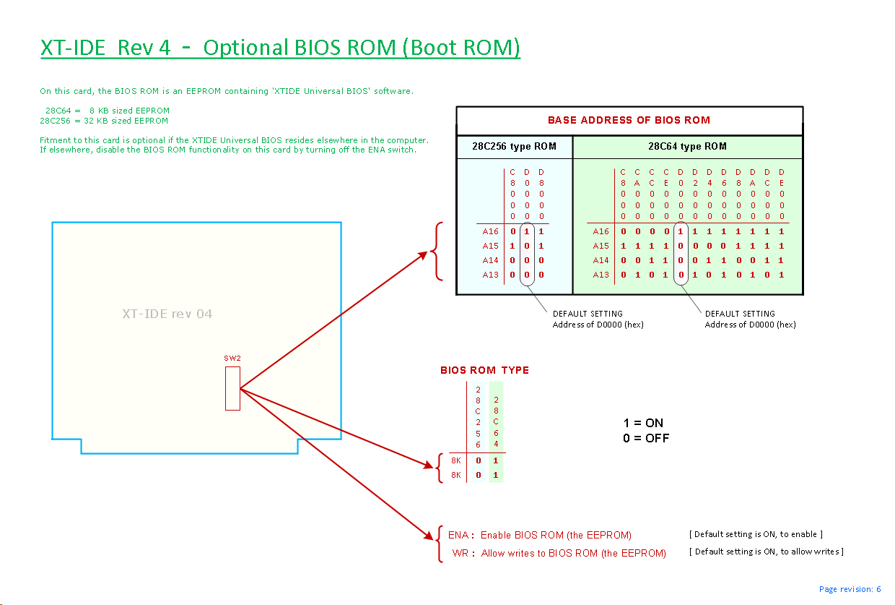
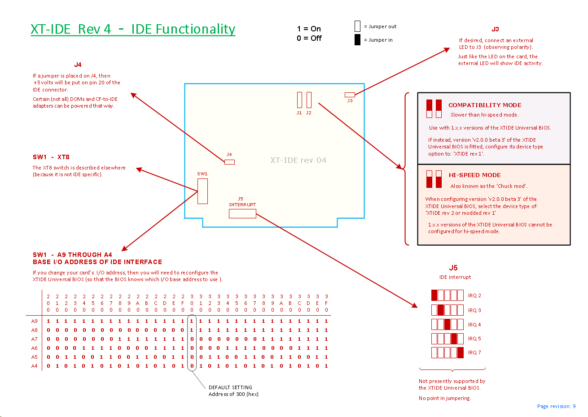
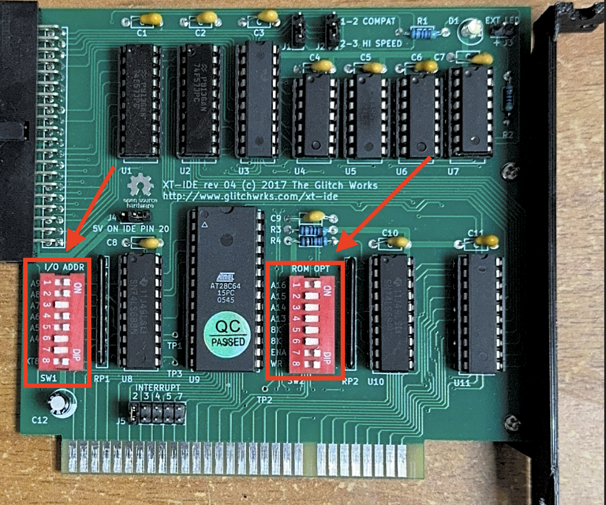

# Оживляем легенду: установка Windows 95 и MS-DOS 6.22 на Intel 486 DX2 с CompactFlash через XT-IDE

Музей процессоров AU-team при РГУ нефти и газа имени И.М. Губкина на протяжении нескольких лет активно собирает коллекцию процессоров – от классических Intel и AMD до экзотических экземпляров вроде Transmeta. С полной коллекцией можно ознакомиться на нашем официальном сайте: https://au-team.ru/museum.

Недавно перед нами встала задача, которая на первый взгляд показалась тривиальной: создать рабочий стенд для тестирования процессоров на Socket 3 (PGA, 237 контактов) – платформе, на которой работали легендарные Intel 486 и поздние модели 386. Казалось бы, что может пойти не так? Берём материнскую плату, ставим жёсткий диск, устанавливаем Windows 95 – и готово.

Однако реальность оказалась сложнее. В нашем распоряжении была единственная подходящая материнская плата – и на ней присутствовали только ISA слоты. Никаких IDE-контроллеров, никаких современных (по меркам 1995 года) интерфейсов. Установка Windows 95 превратилась из рутинной операции в настоящий челлендж.

Выход нашелся, и в этой статье я подробно опишу весь процесс установки Windows 95 OSR 2.5 на Intel 486 DX2-66 через XT-IDE, попутно разобрав принципы работы этого раритетного оборудования. Если вы когда-нибудь задумывались, как оживить компьютер 30-летней давности, или просто интересуетесь историей вычислительной техники – добро пожаловать.

## Почему эта статья заслуживает внимания?

В эпоху, когда процессоры насчитывают миллиарды транзисторов, а операционные системы абстрагируют нас от железа десятками слоёв, мы разучились думать о том, как компьютер работает на самом деле. Современные технологии настолько сложны, что превратились в «чёрные ящики» – мы пользуемся ими, не понимая внутренних механизмов.
Работа с архаичными системами вроде Intel 486 возвращает нас к истокам. Здесь нет привычных удобств: BIOS не видит диски больше 504 МБ, контроллеры не поддерживают DMA, а каждый байт оперативной памяти приходится выбивать с боем. Эти ограничения заставляют задуматься о вещах, которые в современных системах решаются автоматически и незаметно: как процессор обращается к памяти, почему важна разрядность шины данных, что такое CHS-адресация и почему она вообще существовала.
Эта статья будет полезна:

- Фанатам ретрокомпьютинга, которые хотят не просто запустить старое железо, а понять его принципы работы
- Студентам технических специальностей – здесь теория архитектуры ЭВМ оживает на практике
- Инженерам и разработчикам, которые хотят понять эволюцию компьютерных систем и оценить, сколько проблем решено за последние 30 лет
- Всем любопытным, кто хочет увидеть, как выглядела работа с компьютером до эпохи Plug and Play

## Железо для эксперимента: археология с ISA-слотами

Прежде чем погружаться в процесс установки, давайте разберёмся, с чем именно мы работали. Вот полная спецификация нашего стенда:

### Конфигурация системы



**Материнская плата:** UMC UM8498F с AMIBIOS (версия A2133794)  
Ключевая особенность – на плате присутствуют *только ISA-слоты*. Никакого встроенного IDE-контроллера, никаких PCI-слотов. Чистая ISA-археология образца начала 1990-х.

**Процессор:** Intel i486 DX2-50 (маркировка A80486DX2-50, S-spec L503, 2595-я партия)  
Двуядерный множитель ×1, системная шина 25 МГц, внутренняя частота 50 МГц. Да, именно 50 МГц, а не 66 – об этом чуть позже.


**Оперативная память:** 16 МБ (2 модуля по 8 МБ, 72-pin SIMM)  
Для Windows 95 это почти роскошь – минимальные требования составляли всего 4 МБ.

**Видеокарта:** Realtek RTG3105 (ISA, 512 КБ видеопамяти)  
Классическая ISA-видеокарта с чипом Realtek, поддержка VGA и SVGA режимов.

**Накопитель:** Cisco CompactFlash 1 ГБ (Unigen)  
Современная замена IDE-дискам, о которой поговорим подробнее.

**IDE-контроллер:** GlitchWorks XT-IDE rev. 4.0  
Герой нашей истории – плата расширения для ISA, позволяющая подключать IDE-устройства к древним системам.

**Вспомогательная система:** современная материнская плата с FDD и IDE  
Для предварительной подготовки носителей и образов системы.

---

## Подготовка материнской платы: танцы с джамперами

Первым делом нужно было привести материнскую плату в рабочее состояние и проверить работоспособность процессора хотя бы на уровне POST (Power-On Self-Test). 

### Настройка джамперов

Материнские платы эпохи Socket 3 не имели никаких BIOS-настроек для автоматического определения процессора. Всё конфигурировалось физически – через **джамперы** (jumpers) на плате. Это маленькие пластиковые перемычки, которыми замыкались контакты для установки:

- **Частоты системной шины (FSB):** 25, 33 или 40 МГц
- **Множителя частоты:** ×1, ×1.5, ×2, ×2.5, ×3
- **Напряжения ядра:** 3.3V или 5V (зависит от модели процессора)
- **Типа процессора:** 486, 5×86, Pentium OverDrive

Для нашего Intel 486 DX2-50 требовалась следующая конфигурация:
- FSB: **25 МГц**
- Множитель: **×2**
- Напряжение: **5V** (ранние 486 работали на 5 вольтах, поздние – на 3.3V)

Перепутать джамперы – получить либо нерабочую систему, либо в худшем случае сгоревший процессор. Документация на UMC UM8498F, к счастью, сохранилась.

### Универсальность Socket 3: Intel и AMD под одной крышкой

Интересная деталь: Socket 3 (PGA-237, 237 контактов) был **последним универсальным сокетом**, поддерживающим процессоры от разных производителей. На одну и ту же материнскую плату можно было установить:

- Intel 486 (DX, DX2, DX4)
- AMD Am486 и Am5x86
- Cyrix 5x86
- Texas Instruments TX486
- Intel Pentium OverDrive

В современном мире такое даже представить сложно – Intel и AMD давно разошлись по своим несовместимым экосистемам (LGA для Intel, AM4/AM5 для AMD).

---

## Первый запуск: POST без дисков

После выставления джамперов я включил питание. Система прошла POST с характерным пищанием спикера (один короткий сигнал – всё в порядке), BIOS вывел информацию о процессоре и памяти, а затем, как и ожидалось, выдал ошибку отсутствия загрузочных дисков.
Отлично. Процессор работает, память определилась, видеокарта выводит изображение. Теперь нужно решить проблему с накопителем.


## CompactFlash вместо жёсткого диска: выбор музея

В качестве накопителя мы используем **CompactFlash (CF) карту объёмом 1 ГБ** производства Cisco. Почему не старый IDE-диск? На это есть несколько причин:

**1. Надёжность**  
Механические жёсткие диски 1990-х давно выработали свой ресурс. Даже если диск физически цел, его электроника деградировала, смазка в подшипниках высохла, а магнитное покрытие пластин осыпается. CompactFlash – твердотельная память, без движущихся частей.

**2. Совместимость**  
CF-карты используют **IDE-интерфейс на аппаратном уровне**. Через простой адаптер (CF-to-IDE) карта определяется системой как обычный жёсткий диск. Никаких драйверов, никакой магии .

### Капризы старого железа

Важное замечание: **не все CF-карты одинаково полезны**. Старые BIOS и контроллеры крайне чувствительны к особенностям реализации IDE-режима в CF. Мы столкнулись с тем, что:

- Некоторые карты отказывались определяться в BIOS
- Другие работали нестабильно (случайные ошибки чтения)
- Дешёвые китайские ноунейм-карты вообще вели себя непредсказуемо

В итоге методом проб и ошибок мы остановились на **Cisco CF 1 GB** – эта карта стабильно работает со всеми нашими старыми системами. В интернет-сообществах ретрокомпьютинга часто жалуются  на современные китайские CF-карты.

Теперь у нас есть накопитель. Осталось подключить его к системе, в которой нет IDE-контроллера. Для этого и понадобится XT-IDE.

## Установка: Windows 95 через призму истории
Теперь, когда железо подготовлено, можно приступать к установке операционной системы. Но здесь современного пользователя ждёт культурный шок: процесс установки Windows 95 радикально отличается от того, к чему мы привыкли.
### DOS как фундамент: архитектурное наследие
Если сегодня Windows устанавливается с загрузочной флешки как самодостаточная система, то Windows 95 – это графическая надстройка над MS-DOS. Архитектурно она всё ещё опирается на 16-битное ядро DOS, хотя и добавляет 32-битные компоненты (Win32 API).

Это означает, что перед установкой Windows 95 необходимо сначала установить MS-DOS 6.22.

### Подготовка установочных дискет

Оригинальный MS-DOS 6.22 распространялся на трёх 3.5" дискетах объёмом по 1.44 МБ каждая. Мы использовали образы с архива WinWorld PC (https://winworldpc.com/product/ms-dos/622) – это один из крупнейших репозиториев старого ПО.
Для записи образов на физические дискеты используем утилиту Win32 Disk Imager на современном ПК с Windows.

### Проблема курицы и яйца: временная система
Здесь мы столкнулись с классической проблемой: чтобы установить DOS на CF-карту, нужен рабочий FDD (Floppy-дисковод). Но наша материнская плата UMC UM8498F имеет только ISA-слоты, и хотя на ней есть разъём для FDD, у нас под рукой на тот момент не было подходящего FDD контроллера для ISA. 
Плата XT-IDE тоже пока не работает – её нужно сначала прошить, а для этого требуется уже установленная DOS. Классический замкнутый круг.
Решение: использовать промежуточную систему. У нас в музее есть материнская плата с Intel Pentium на борту, где присутствуют:

- Встроенный IDE-контроллер
- Контроллер FDD (подключение 3.5" дисковода)
- Стандартные разъёмы для современного питания
- Один ISA слот

Именно на ней мы и будем проводить первичную установку DOS на CF-карту, а затем перенесём готовую карту обратно в Socket 3 систему.

Перед началом установки убедимся, что CF карта не содержит разделов и находится в MBR (для этого мы использовали Diskpart).

Процесс установки MS-DOS 6.22
Подключаем к временной системе:

3.5" FDD через стандартный 34-pin шлейф,
CF-карту через IDE-адаптер (CF → 40-pin IDE)

Вставляем Disk 1 и включаем питание. В BIOS выставляем загрузку с флоппи-дисковода (Boot Priority: Floppy → HDD).
Система загружается с дискеты и запускает установщик MS-DOS. Первое, что он делает – предлагает отформатировать целевой диск:
Setup will now format drive C:

Начинается форматирование CF-карты с созданием файловой системы FAT16. Это единственная файловая система, которую понимает DOS. Никаких NTFS, exFAT или ext4 – только 16-битная таблица размещения файлов, появившаяся ещё в 1987 году.
После форматирования установщик копирует системные файлы с дискеты на CF-карту.

Please insert Setup Disk 2 and press ENTER.
Вынимаем Disk 1, вставляем Disk 2, жмём Enter. Процесс продолжается. Через минуту – запрос на Disk 3. Ещё минута – и установка завершена.

MS-DOS установлен. Но это только первый шаг. Теперь нужно разобраться с XT-IDE, чтобы эта CF-карта заработала на нашей Socket 3 материнской плате.

### XT-IDE: мост между эпохами
CF-карта с DOS готова, но есть нюанс: её некуда подключить на UMC UM8498F. На плате нет IDE-контроллера – только ISA-слоты. Именно здесь на сцену выходит GlitchWorks XT-IDE rev. 4.0.

Для операционной системы (DOS, Windows 95) это выглядит так, будто диск подключен к обычному IDE-контроллеру. Магия происходит на низком уровне – BIOS Extension делает всю грязную работу.

## XT-IDE: Open Source мост в прошлое

**GlitchWorks XT-IDE** – это не коммерческий продукт, а [**open source проект**](https://github.com/glitchwrks/xt_ide), разрабатываемый сообществом энтузиастов ретрокомпьютинга. Проект активно поддерживается до сих пор: последние обновления firmware выходят до сих пор [XT-IDE Universal BIOS](https://xtideuniversalbios.org/binaries).

### Где достать плату?

В рунете XT-IDE встречается редко – это не массовый продукт, и придётся потратить время на поиск. Иногда их продают на авито или в тематических Telegram-каналах. Но если вы умеете работать с паяльником, **все файлы для самостоятельного изготовления платы доступны в открытом доступе**:

- Схема (schematic) и разводка PCB в формате KiCad/Eagle
- BOM (Bill of Materials) – список компонентов с артикулами
- Gerber-файлы для заказа печати платы на фабриках вроде JLCPCB (через посредников)

### Возможности XT-IDE: не только жёсткие диски

Плата поддерживает несколько режимов работы, что делает её универсальным инструментом:

1. **Подключение IDE-устройств:** HDD, CF-карты, DOM-модули (Disk-on-Module)
2. **Загрузка по сети (Ethernet Boot):** экспериментальная функция через специальный модуль расширения
3. **Эмуляция дисковода:** возможность использовать образы дискет, хранящиеся на CF-карте
4. **Serial Boot:** загрузка образов через COM-порт (полезно для отладки)

Для нашей задачи нужен только первый режим – подключение CF-карты как IDE-диска.

## Настройка джамперов: адресация портов ввода-вывода

XT-IDE настраивается через **джамперы**. Это критически важный этап, потому что в старых системах адресация портов ввода-вывода (I/O Address Space) распределяется вручную, и конфликты приводят к полной неработоспособности.

### Что нужно настроить?

На плате XT-IDE rev. 4.0 джамперами задаются два ключевых параметра:

**1. ROM Address (адрес Option ROM в памяти)**  
Это диапазон адресов в верхней памяти (Upper Memory Area, 640 КБ - 1 МБ), куда BIOS материнской платы загрузит прошивку XT-IDE при старте системы. Типичные варианты:
- `C800h` - `CBFFh` (стандартный адрес для IDE-контроллеров)
- `D000h` - `D3FFh` (альтернатива, если C800h занят)

Мы выбрали **C800h**, потому что на нашей UMC UM8498F этот диапазон свободен. Выставление джамперов происходит по данной схеме:



На первый взгляд, таблица может показаться не совсем логичной, поэтому предложу свой вариант:
```
1: 0b110 + A16
2: 0b + A15 + A14 + A13 + 0b0
3: 0x0
4: 0x0
где A(№) – 0/1
```

**2. I/O Port Base Address (базовый адрес портов IDE-контроллера)**  
Это адрес в пространстве портов ввода-вывода (I/O space, 0000h - FFFFh), по которому процессор будет обращаться к IDE-контроллеру на плате. Стандартные адреса для IDE:
- `1F0h` - `1F7h` (Primary IDE Channel)
- `170h` - `177h` (Secondary IDE Channel)
- `300h` - `30Fh` (альтернативные адреса для ISA-плат)

**Проблема:** адреса 1F0h и 170h уже зарезервированы стандартом для встроенных IDE-контроллеров (которых у нас нет, но BIOS всё равно может их «видеть»). Чтобы избежать конфликтов, мы выбрали **нестандартный адрес 340h**.



### Почему адресация так важна?

В архитектуре x86 процессор общается с периферией через **порты ввода-вывода** (I/O ports). Каждому устройству (видеокарта, звуковая карта, IDE-контроллер) выделяется диапазон адресов в пространстве 0000h - FFFFh. Если два устройства занимают один и тот же адрес – конфликт гарантирован:

- В лучшем случае одно устройство не работает
- В худшем – система зависает при загрузке или повреждает данные

На современных ПК это решается автоматически через **PnP (Plug and Play)** и **ACPI**, но в эпоху ISA всё настраивалось вручную. Именно поэтому нужно знать карту портов:

| Диапазон адресов | Устройство |
|------------------|------------|
| 0x3B0 - 0x3BF | Monochrome Display Adapter (MDA) |
| 0x3C0 - 0x3DF | VGA/SVGA (наша Realtek RTG3105) |
| 0x1F0 - 0x1F7 | Primary IDE (зарезервирован) |
| 0x170 - 0x177 | Secondary IDE (зарезервирован) |
| 0x340 - 0x34F | **XT-IDE (наша плата)** |

Адрес **340h** находится в «свободной зоне», не пересекаясь с системными устройствами.

Вот конфигурация джамперов на нашей плате:



---

## Прошивка и настройка XTIDE Universal BIOS

На плате XT-IDE установлена микросхема **Atmel AT28C64** – это EEPROM (Electrically Erasable Programmable Read-Only Memory) объёмом 8 КБ. В неё записывается [**XTIDE Universal BIOS**](https://xtideuniversalbios.org/binaries/) – программная прошивка, которая управляет IDE-контроллером и обеспечивает совместимость с DOS и старыми BIOS.

## Конфигурация через xtidecfg.com

Для настройки BIOS используется утилита **xtidecfg.com** – DOS-программа с псевдографическим интерфейсом. Она идёт в комплекте с прошивкой XTIDE Universal BIOS.

Запускаем её на нашей временной системе (Pentium + CF с установленным DOS):

```
C:\>xtidecfg.com
```

Открывается меню конфигуратора:

[ЗДЕСЬ БУДЕТ СКРИНШОТ ГЛАВНОГО МЕНЮ XTIDECFG]

### Основные настройки

**1. Base (Command Block) Address: 340h**

Это тот самый адрес портов ввода-вывода, который мы выбрали джамперами. Здесь указываем **340h** (шестнадцатеричное значение).

**Command Block** – диапазон из 8 портов (340h - 347h), через которые процессор отправляет команды IDE-устройству:
- 340h: Data Register (передача данных)
- 341h: Error/Features Register
- 342h: Sector Count
- 343h: Sector Number / LBA Low
- 344h: Cylinder Low / LBA Mid
- 345h: Cylinder High / LBA High
- 346h: Drive/Head Select
- 347h: Status/Command Register

**2. Control Block Address: 348h**

**Control Block** – это дополнительный порт (обычно Base + 8), используемый для управления состоянием устройства и сброса контроллера. Указываем **348h**.

**3. Device Type: XT-IDE rev. 1**

Здесь выбираем тип аппаратной реализации контроллера на плате. У нас плата rev. 4.0, но в меню нужно выбрать **XT-IDE rev. 1**. 

Странность? Да. Но выбор "rev. 2" приводит к тому, что CF-карта не определяется. Это известная особенность совместимости – rev. 2 использует немного другую логику работы с портами, которая конфликтует с некоторыми старыми BIOS. Rev. 1 работает стабильно.

**4. IRQ (Interrupt Request): Disabled**

ISA-контроллеры обычно работают через прерывания (IRQ), но XT-IDE может работать и в **polling mode** (опрос состояния контроллера в цикле). Для максимальной совместимости с древними BIOS оставляем прерывания выключенными.

(to be continued)
